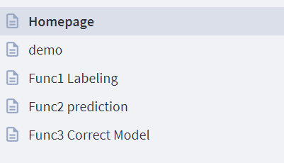

# Group09


## Project discription
This project is to provide an out-of-the-box tool for car damage **classification**. There are four kinds of damages for us to classify: dent, scratch, rim and other.
We provide two main functions: 
- Training a user designed model from scratch.
- Experiencing it with web interface (main function required by this course).

To directly experience the website function, it is recommended to use docker as it has already included all the packages and data needed.  
To join us as a developer, here is the <a href="#Development">hand-by-hand tutorial</a>
## Starting with Docker
To use our out-of-the-box functions like labeling and prediction, you can run the Docker container directly and access the assigned port in your beloved browser.
The Docker container already include every library and file necessary for this project.
### docker: How to run the container on your PC?
1. Find image in Container Registry, and copy image path.
Details: Select the project "Group09", on the left sidebar please klick on "Packages and Registery"-"Container Registery", find the image, then klick on the button on the right above corner of the image name, to copy image path.
2. Make sure you are runnung Docker Desktop on your PC.
3. Login onto the registry in a terminal.
```
docker login gitlab.ldv.ei.tum.de:5005
```
4. Run the container, appoint corresponding port to listen.
```
docker run --rm -it -p 8888:8888 gitlab.ldv.ei.tum.de:5005/ami2022/group09
```
5. Open your browser and go to:
```
 localhost:8888
 ```


## Starting Development
<a name="Development"></a>
If you are a member of our development team, or you want to run the project locally instead of on Docker, you should follow the following steps.
### Prerequisites
#### Part1
- Python >= 3.8
- PyTorch 1.12 with cuda 11.6
.Please check [here](https://pytorch.org/get-started/locally/) for the download
#### Part2
- streamlit==1.12.2
- streamlit_player
- streamlit_lottie
- seaborn
- tensorboard==2.8.0
- pytorch-lightning==1.6.5
- matplotlib
- structlog==21.1.0
- baal == 1.3.2
- numpy
- avalanche-lib
- typing
- scikit-learn
- opencv-python

[//]: # (```)

[//]: # ()
[//]: # (pip3 install torch torchvision torchaudio)

[//]: # ()
[//]: # (  ```)
For part1, please go to their website for download. For part2, you can just simply run the following command
```
git clone https://gitlab.ldv.ei.tum.de/ami2022/Group09.git
pip install -r requirements.txt
```
- Streamlit
```
pip install streamlit==1.12.2
```

### Dataset download
We provide two kinds of datasets. One is the cropped original dataset by the bounding-boxs,
and the other is with enlarged bounding-boxs but the same central points.  
In addition, we collected some images online as a complement to our existing dataset.
Reminder: These links will expire on 31.12.2022.
```sh 
Original dataset: https://syncandshare.lrz.de/getlink/fiWUoSschwnwb35dHi41Y6KZ/data_small.zip
Enlarged bounding-box dataset: https://syncandshare.lrz.de/getlink/fiLeMf8iiueYoTBmfbkJEpZT/data_large.zip
Supplement dataset: https://syncandshare.lrz.de/getlink/fi2aD5XJjkn8f4SsFTyz8NMx/data_supplement.zip
```
For demo you can just download the [enlarged bounding-box dataset](https://syncandshare.lrz.de/getlink/fiLeMf8iiueYoTBmfbkJEpZT/data_large.zip)

After downloading the dataset, you should first create a folder `development/Data` and extract the dataset them into this folder, which will looks like this:
```
|-- Development
    |-- Data
        |-- dent
        |-- other
        |-- rim
        |-- scratch
    |-- Model
    |-- Web
    ...
    ...
```

### Split dataset
Now we have our dataset, but typically we need to split the dataset into training set and validation set.
Open `split.py`, set a random seed and assign the percentage of the training set (80% by default). The rest of them become validation set.  
Run `split.py`, now you can find two more folders `train` and `val`, and each of them contain four folders corresponding to four classes.

```
cd Development
python split.py
```
```
|-- Development
    |-- Data
        |-- dent
        |-- other
        |-- rim
        |-- scratch
        |-- train
            |-- dent
            |-- other
            |-- rim
            |-- scratch
        |-- val
            |-- dent
            |-- other
            |-- rim
            |-- scratch
```

For **Semi-Supervised Learning** and **Active Learning** the dataset will be a little different, and will be explained later.

[//]: # (### Load your data)

[//]: # (We use the function provided by PyTorch called `torchvision.datasets.ImageFolder`. It takes the path of a folder as input, and returns a dataset object with its subfolder as labels. For example:)

[//]: # (```)

[//]: # ()
[//]: # (```)

### Prepare your own model
This part we will give you an introduction about how to create you own model within our Architecture.
- `main.py` is where your dream begins. Here you can execute the whole precess of training. In the existed example, you can see that we use a `resnet18` model, this model is defined in `model.py`.
- In `model.py`, a template for `resnet18` is already existed. You can manage the hyperparameters like optimizer, learning rate, loss function and batch size.  
Remember to change `num_epochs` when training. Since we use a pre-trained model, the number of epochs do not need to be too large.
- Apart from hyperparameters, you may also want to try different transforms. You can import any transform from `preprocessing.py`, or add a self-defined transform here.
- After training, a `.pt` file will be saved in `Model`.

### Test your model
To know the performance of models. We provide a module called `test.py`. In the line `model = torch.load("Model/resnet18.pt")`, change the name to the your model file, and it will print the *Accuracy*, *recall rate by class*, *precision by class*.
### Provided Models
- Dummy
- VGG16([Download here](https://drive.google.com/file/d/1cdD0Rz2E6YLTQefU85dp_IkvzTWBIJ0S/view?usp=sharing))
- Resnet18
- Active Learning
- Semi-Supervised Learning
- Continual Learning
#### Active Learning
```angular2html
cd Development/ActiveLearning_Model
Python Active_Learning.py
# you need to Annotate images manually
```
#### Continual Learning
```angular2html
cd Development/ContinualLearning_Model
Python CL_selfdefined_dataset.py
```
## Website Usage
We build our website with Streamlit. Streamlit turns data scripts into shareable web apps in minutes.
All in pure Python. No front‑end experience required.
### Preparation  
Streamlit is a python package, and it executes the python codes of models directly, so it is necessary to install the required packages mentioned in the previous section.
### Execution
To execute the website, first open your terminal and go the directory of `Development`
```
cd Group09/Development
```
Keep in mind that if you are in the wrong directory, you can still execute the website, but some resources may not be able to loaded.  
Next, type `streamlit run Web/Homepage.py` in terminal, and a website will be opened automatically in your default browser.  

To assign a port for this website:
```
streamlit run Web/Homepage.py --server.port 8501
```
Now, in terminal, you can find one Local URL and one Network URL. You can visit the website from public network with Network URL.  
To stop exectuing the website, press `ctrl+C` in terminal.
### Website


- Homepage: Introduction about our project
- demo: Concepts and some results of our models

Apart from Homepage and demo page, we have three function-page. 

- Labeling: Users can use this interface to label their own dataset and download as zip file
- Prediction: This interface can make predictions on given image using our provided models. If user is satisfied with the prediction, they can mark the given image as uncertain data and retrain the model in Func3
- Correct Model: This interface can re-label the uncertain image from the prediction and retrain the model
